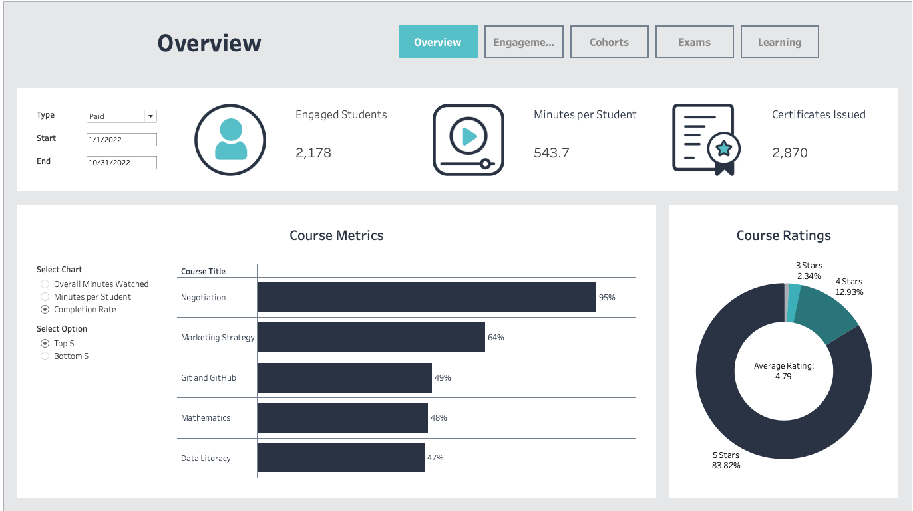
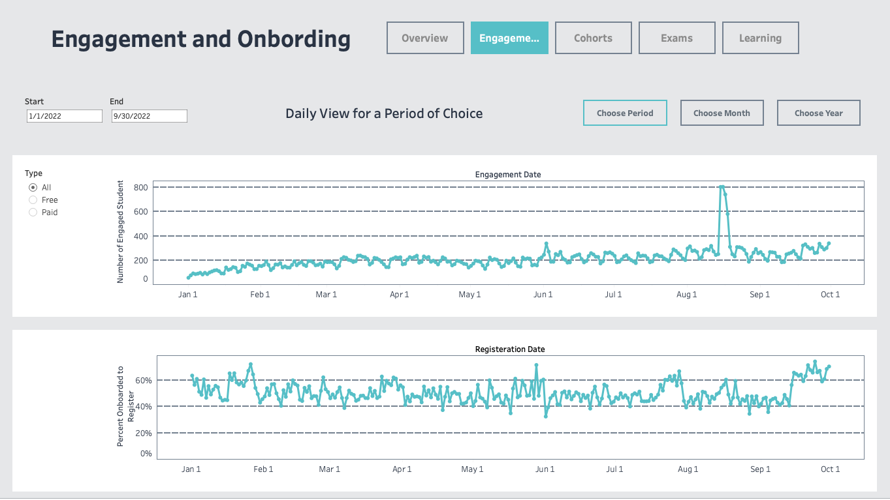
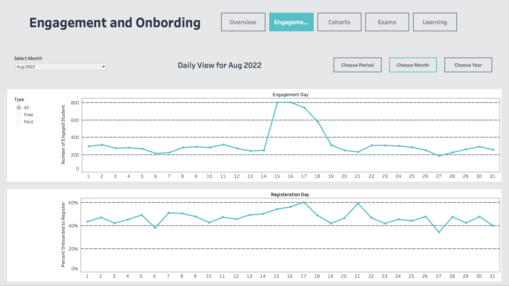
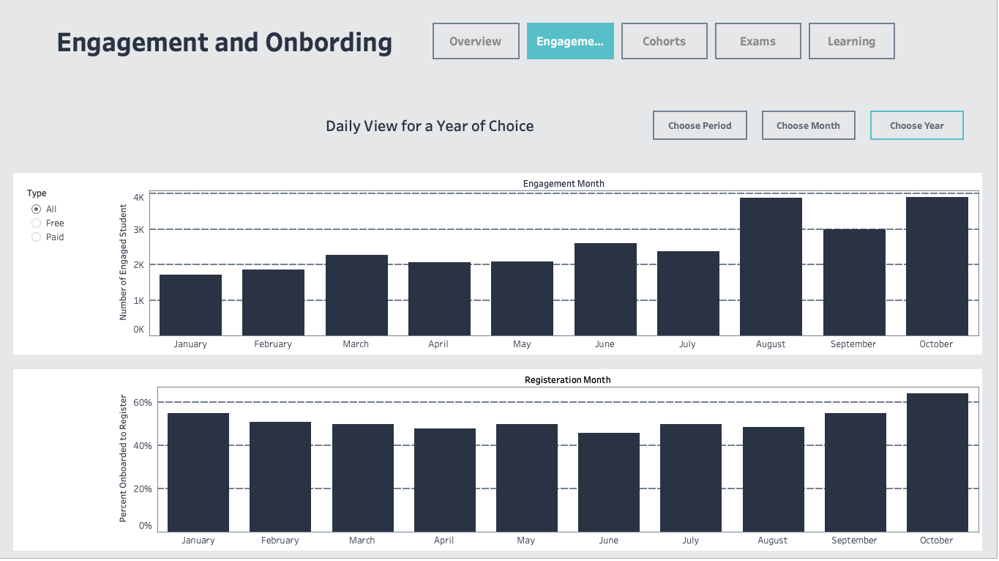
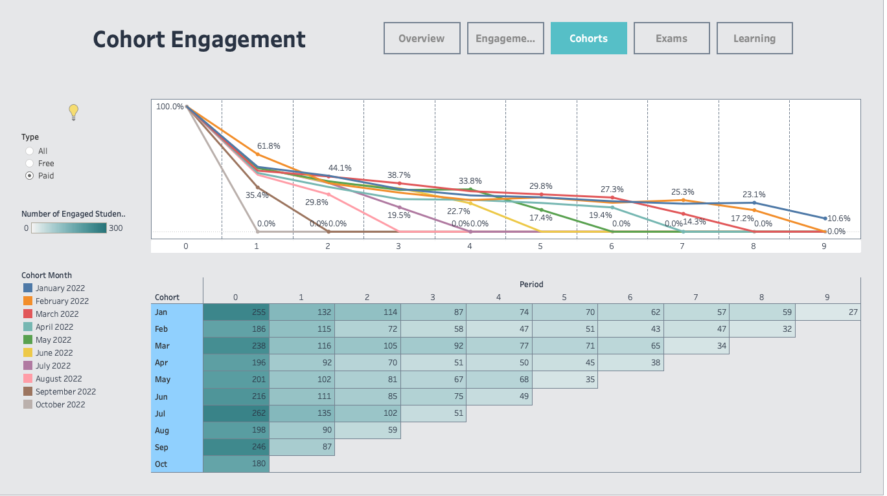
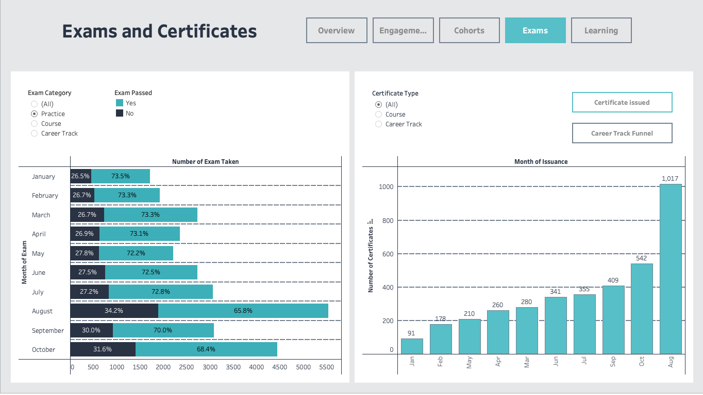
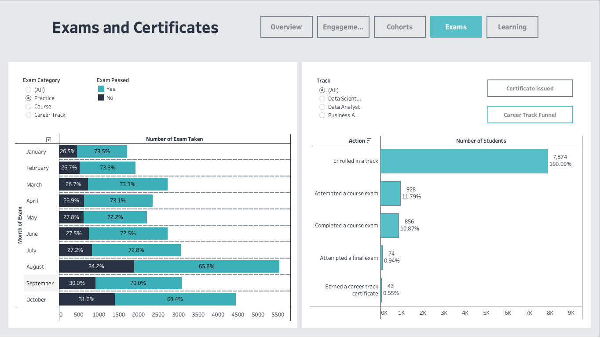
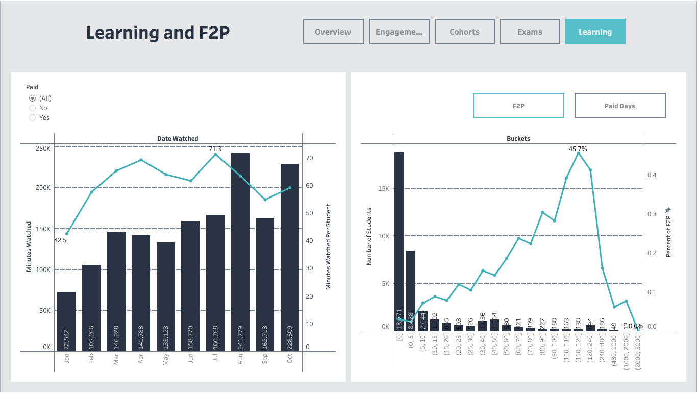
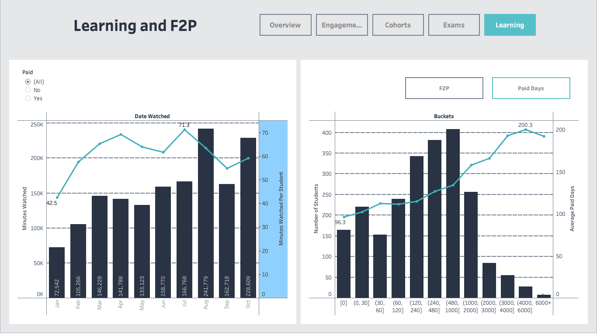

# Customer Engagement Analysis (SQL + Tableau)

This project analyzes **real anonymized data** from an online learning platform, provided through a SQL and Tableau course on Udemy. The dataset contains records for **19,332 users** across a **10-month period** (January to October 2022), capturing behavior such as registration, **66,460 video watch logs**, subscription activity, over **15,000 exam attempts**, and more than **4,000 certificates issued**.

Through a series of structured SQL queries, I transformed raw platform data into analysis-ready tables, covering different stages of the student lifecycle. These were visualized in Tableau Public using a set of interactive dashboards focused on engagement, onboarding, conversion, course performance, and career track progress.

Dashboard from this project are published on Tableau Public:

🔗 [View on Tableau Public](https://public.tableau.com/app/profile/libei.wang/viz/learning_platform_customer_behavior/Overview?publish=yes)

## SQL Usage in This Project

SQL was the foundation of this project. I used it not only to extract and join data across multiple relational tables, but also to implement business logic directly through `CASE` statements, aggregations, window functions, and Common Table Expressions (CTEs).

The queries were designed with scalability and readability in mind, making use of layered transformations to build clear, modular logic. I also created intermediate and final output tables using `CREATE TABLE AS SELECT` to support Tableau dashboards. These SQL workflows simulate a simplified data pipeline and demonstrate how analytical reporting can be structured entirely within SQL.

## Tableau Visualizations

### 1. Overview Dashboard

This dashboard provides a high-level summary of student engagement and course performance on the platform. It includes:

- **Key Metrics**: Number of engaged students, average minutes per student, and total certificates issued
- **Course Metrics Selector**: A dynamic bar chart that shows either:
  - Overall minutes watched
  - Minutes per student
  - Completion rate  
  for the top or bottom 5 courses, depending on user selection
- **Course Rating Breakdown**: A donut chart displaying the distribution of course ratings along with the average rating

### 2. Engagement and Onboarding Dashboard

This dashboard shows platform activity and onboarding success over a user-selected time period. It includes:

- **Daily Engagement**: Line chart tracking the number of engaged students per day  

- **Daily Onboarding Rate**: Line chart showing the percentage of newly registered users who became onboarded on each date

  > **Onboarding Definition**:  
  > A student is considered onboarded if they have done at least one of the following:  
  >
  > - Watched a video  
  > - Solved a quiz  
  > - Attempted an exam

Users can filter by subscription type (All, Free, Paid) and select a custom date range.

#### Monthly Detail View

To explore trends in more detail, users can select a specific month to see day-by-day engagement and onboarding rates. This helps identify spikes or dips in platform activity across different periods.

#### Yearly Summary View

This view summarizes student engagement and onboarding rates across all months in the dataset. Although the current dataset covers only one year, the dashboard is structured to support multi-year comparisons in the future.

- **Monthly Engagement**: Bar chart showing the total number of engaged students per month
- **Monthly Onboarding Rate**: Bar chart showing the average onboarding rate for students registered in each month

### 3. Cohort Engagement Dashboard

This dashboard presents a cohort analysis of student engagement over time. It consists of:

- **Retention Curve**: A line chart showing the percentage of active users in each monthly cohort across 10 periods (weeks or months depending on context)
- **Cohort Table**: A heatmap-like table showing the number of active users per cohort per period. The color scale reflects relative engagement intensity

Users can filter the chart by:
- **Subscription Type**: All, Free, or Paid
- **Cohort Month**: To focus on specific user entry periods

A hover tooltip (lightbulb icon) provides guidance on how to interpret and use the cohort chart effectively.

### 4. Exams and Certificates Dashboard

#### Certificate Issuance View

This dashboard analyzes exam activity and certificate issuance over time.

- **Left Chart – Monthly Exam Breakdown**: Stacked bar chart showing the number of passed vs. failed exams per month. Users can filter by exam category (Practice, Course, Career Track)
- **Right Chart – Certificate Issuance**: Bar chart showing the number of certificates issued per month. Certificate type (Course or Career Track) can be selected via filter

#### Career Track Funnel View

This alternate view retains the same monthly exam breakdown on the left and replaces the right panel with:

- **Career Track Funnel**: Horizontal bar chart showing the number of students progressing through key actions in a career track:
  - Enrolled in a track
  - Attempted a course exam
  - Completed a course exam
  - Attempted a final exam
  - Earned a career track certificate

### 5. Learning and F2P Dashboard

#### F2P Conversion View

This dashboard explores how much students watch and how that relates to conversion behavior.

- **Left Chart – Monthly Viewing Trends**: A combo chart showing total minutes watched (bar) and average minutes per student (line) by month
- **Right Chart – F2P Conversion by Engagement Bucket**: Each bar represents the number of students in a given watch-time range; the line shows the percentage of students in each bucket who converted from free to paid

#### Paid Duration View

The left chart remains the same, while the right chart shows:

- **Paid Days by Watch-Time Bucket**: Each bar represents the number of students within a given total watch-time range; the line shows the average number of paid subscription days per group

